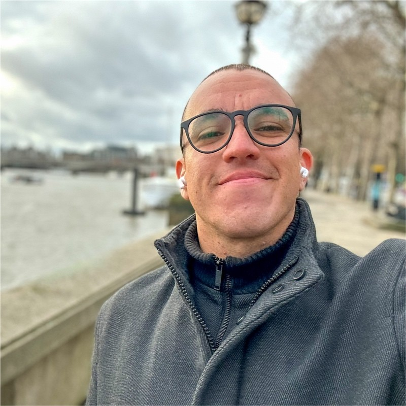

# Douglas Ryan

**Senior Software Engineer**

São Paulo, SP - Brazil  
Email: douglas.pujol@outlook.com 
GitHub: [https://github.com/douglaspujol]([https://www.linkedin.com/in/douglaspujol/](https://github.com/douglaspujol))
LinkedIn: [linkedin.com/in/douglaspujol](https://www.linkedin.com/in/douglaspujol/)

---

## **Summary**

Hello! I am a software engineer with nearly 6 years of experience, specializing in front-end and full-stack development. I develop web and mobile solutions, always aiming to create scalable applications that provide exceptional user experiences. Throughout my professional journey, I have had the privilege of contributing to various projects, working with large companies and startups across Latin America.

Currently, I work as a Tech Lead at Orbia, a company in the agribusiness sector, where I develop a global marketplace for the agricultural industry. I have solid expertise in technologies like ReactJS, React Native, Expo, Typescript and Node. I dedicate my time to studying system design, micro front-ends, BFF (Backend for Frontend), Golang, as well as other related fields.

Passionate about leveraging technology to solve complex challenges, I focus on building solutions that make a real difference in users’ lives. Eager to learn, I’m always exploring new approaches and excited to work on projects that push the boundaries of what’s possible.

---

## **Professional Experience**

### **Tech Lead | Specialist Software Engineer**

**Orbia**, São Paulo  
**Mar 2024 – Present**

- Lead a team in developing a global marketplace for the agribusiness sector.
- Actively contribute to the development, being involved in project architecture and feature building.
- Develop scalable and innovative solutions to connect farmers, suppliers, and buyers globally.
- Manage projects with an international scope, supporting three languages and ensuring the best user experience.

**Technologies Used:** ReactJS, React Native, Next.js, Node.js, Expo, Tailwind CSS, Micro Front-ends, BFF (*Backend for Frontend*), Internationalization Strategies, AWS

---

### **Tech Lead | Specialist Software Engineer**

**BrandLovrs**, São Paulo  
**Nov 2022 – Feb 2024**

- Led the development and architecture of an application in the **Creator Economy** sector.
- Collaborated with cross-functional teams to enhance user experience and deliver high-quality features.

**Technologies Used:** ReactJS, React Native, Expo, Node.js, AWS

---

### **Senior Software Engineer**

**Qintess**, São Paulo  
**Sep 2021 – Nov 2022**

- Worked on various projects for clients such as Dell, Serasa, Natura, and Bankly.
- Developed and improved systems across multiple sectors, contributing to technological innovation for companies.

**Technologies Used:** ReactJS, React Native, Angular 10+, Stencil JS, AWS,  Node.js

---

### **Senior Software Engineer**

**Controlle**, Santa Catarina  
**Nov 2020 – Sep 2021**

- Developed and maintained a financial management system for small businesses.
- Led a team of junior developers, coordinating tasks and providing guidance on best development practices.
- Collaborated closely with product and design teams to align features with customer needs.

**Technologies Used:** ReactJS, Node.js, Redux, Redux-Saga, Styled Components

---

### **Senior Software Engineer**

**Compasso UOL**, Rio Grande do Sul  
**Jan 2020 – Nov 2020**

- Participated in the development team for an e-commerce platform of a major retail company in Brazil called **Leo Madeiras**.
- Worked on front-end development using technologies like KnockoutJS and **Oracle Cloud Commerce (OCC)**.

**Technologies Used:** KnockoutJS, Oracle Cloud Commerce (OCC)

---

### **Software Engineer**

**Coobrastur Viagens e Turismo Ltda.**, Rio Grande do Sul  
**Nov 2018 – Nov 2019**

- Developed a **BFF** (Backend for Frontend) in Node.js responsible for integrating marketing platforms like **RD Station** and **Pipedrive**.
- The BFF was used to track leads and synchronize data between platforms.
- Developed a sales system for hotel packages using ReactJS and Next.js.

**Technologies Used:** Node.js, ReactJS, Next.js, BFF (*Backend for Frontend*), Integration with RD Station and Pipedrive

---

## **Skills**

- **Technical Leadership**
- **ReactJS & React Native**
- **AWS**
- **Micro Front-ends**
- **Next.js**
- **Node.js**
- **Expo**
- **UX/UI Design**
- **System Design**
- **BFF (Backend for Frontend)**

---

## **Languages**

- **Portuguese:** Native
- **English:** Intermediate (B2 Upper Intermediate)
- **Spanish:** Intermediate (B2)

---

## **Notable Projects**

### **Orbia Marketplace System**

**Role:** Tech Lead  
**Description:** Lead the development of a multilingual marketplace system for the agribusiness sector, connecting farmers, suppliers, and buyers globally.

**Achievements:**

- Actively participated in the project architecture and feature development.
- Integrated internationalization to support three languages.
- Implemented micro front-ends architecture for modularity and scalability.
- Used Next.js, Tailwind CSS, and AWS for a responsive user interface and scalable infrastructure.

**Technologies:** ReactJS, React Native, Next.js, Node.js, Expo, Tailwind CSS, Micro Front-ends, BFF (*Backend for Frontend*), Internationalization Strategies, AWS

---

### **BrandLovrs Application**

**Role:** Tech Lead  
**Description:** Directed the development and architecture of an application in the **Creator Economy** sector.

**Technologies:** ReactJS, React Native, Expo, Node.JS, AWS

---
